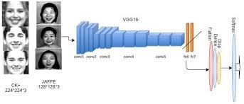

<h1 style="align: center; color: #159957">Métodos de Deep Learning aplicado al Reconocimiento de Expresiones Faciales</h1>

Código que acompaña a la tesis "Métodos de Deep Learning aplicado al Reconocimiento de Expresiones Faciales"

### Database
Descargue el conjunto de datos FER-2013 [aquí](https://www.kaggle.com/msambare/fer2013) y extraer. Los datos consisten en imágenes de rostros en escala de grises de 48x48 píxeles. Los rostros se han registrado automáticamente para que el rostro esté más o menos centrado y ocupe aproximadamente la misma cantidad de espacio en cada imagen.

cada rostro muestra una expresión facial en una de siete categorías (0 = Enojado, 1 = Disgusto, 2 = Miedo, 3 = Feliz, 4 = Triste, 5 = Sorpresa, 6 = Neutral). El conjunto de datos de entrenamiento consta de 28.709 imágenes y el conjunto de datos de prueba consta de 7.178 imágenes:

### Arquitecturas
*(VGG-16)*

### Referencias
[10.33407/itlt.v60i4.1743](https://www.researchgate.net/publication/320307642
) | [10.1109/CVPR.2001.990517](https://ieeexplore.ieee.org/document/990517) | [	arXiv:1307.0414 [stat.ML]](https://arxiv.org/pdf/1307.0414.pdf)
